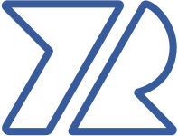

Hello, 
My name is Romaric YI and this is my portfolio.
I'm happy to share it with you.

   
  
  <h1>Yi Romaric - Portfolio</h1>

 

  
  

    <a href="https://www.linkedin.com/in/yiromaric/">🙋‍♂️Romaric YI</a>
  

 
 

<h2>Technologies</h2>
  
  
  
  
  
  
  
  

